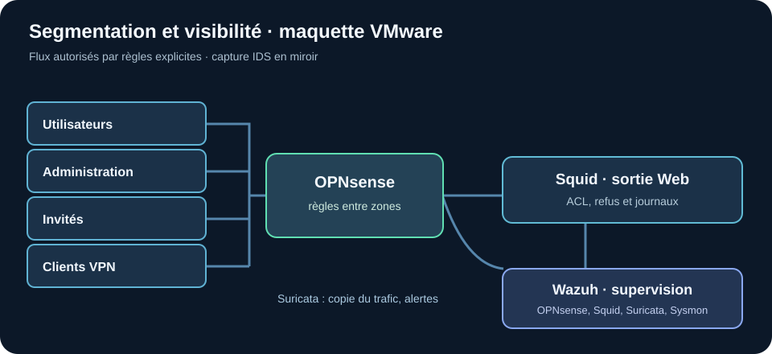
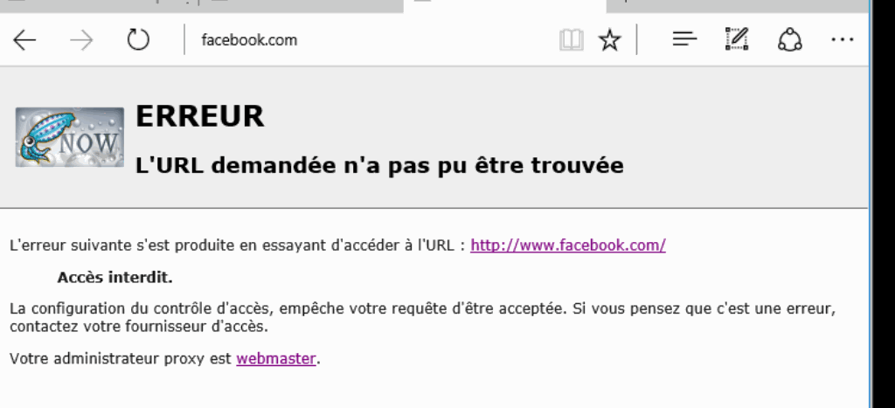

# Méthodologie — architecture réseau sécurisée

> Maquette personnelle sous VMware Workstation. Cette version décrit le rapport technique et les incidents de test consignés dans le README du dépôt, sans recopier noms, adresses, identifiants, certificats ni secrets.

## 1. Définir les flux nécessaires

Dans le scénario d'entreprise fictive, les utilisateurs, l'administration, les invités, les services exposés et le VPN ne doivent pas partager les mêmes autorisations. Avant toute règle, définir les flux dont chaque groupe a réellement besoin, les services administratifs à protéger et le comportement attendu si une zone est compromise.

## 2. Construire la maquette et les zones

Des réseaux virtuels séparés sont reliés à OPNsense. Une DMZ héberge le proxy ; une zone d'administration porte les accès privilégiés. Le rapport précise des VLAN et interfaces, mais le diagramme ci-dessous ne révèle pas le plan d'adressage.

## 3. Configurer OPNsense et vérifier les règles

Configurer interfaces, NAT et règles de pare-feu par zone. Comparer la liste des flux autorisés au besoin métier, puis tester **depuis chaque zone**, y compris un poste utilisateur standard. Le premier README signale que l'interface d'administration OPNsense restait accessible depuis la zone utilisateurs : la règle de restriction a été corrigée, puis l'accès doit être revérifié depuis une zone autorisée et une zone non autorisée.

**Impact avant correction :** bloquer trop largement une zone peut interrompre DNS, proxy ou administration ; laisser un accès à la WebGUI depuis les utilisateurs élargit la surface d'attaque. Conserver un accès d'administration fonctionnel pour revenir sur une règle erronée.

## 4. Interposer le proxy et examiner l'effet des ACL

La configuration Squid couvre contrôle des requêtes, ACL et journaux. Les tests du rapport comportent navigation et refus ciblé. L'extrait recadré suivant prouve qu'une requête précise a été refusée, **sans prouver** que tout le trafic HTTP/HTTPS du laboratoire passait obligatoirement par le proxy.

**Impact à vérifier :** un proxy ou une inspection TLS mal configurée peut casser des applications ; un filtrage contournable laisse une sortie directe non contrôlée. Tester séparément accès permis, refus attendu, authentification et journal associé.

## 5. Limiter le VPN aux seules ressources utiles

Configurer l'accès OpenVPN avec certificats et MFA, puis tester un utilisateur VPN contre les zones internes. Le README d'origine indique qu'une règle automatique « allow all » donnait accès aussi à l'administration ; elle a été supprimée au profit de règles explicites. Vérifier que les applications légitimes restent accessibles et que la WebGUI OPNsense ne l'est plus depuis le VPN.

## 6. Réunir les journaux et corriger leur qualité

Le rapport décrit la collecte des événements OPNsense, Squid, Suricata et des endpoints dans Wazuh, ainsi que l'intégration de Sysmon. Le README d'origine signale un cas précis : le journal Squid remontait l'IP, mais pas le nom utilisateur. Le décodeur Wazuh a été adapté ; pour valider, corréler une requête de test au compte attendu dans l'alerte. Sans identité fiable, une investigation attribuerait difficilement le trafic à une personne ou à une session.

## 7. Suricata en mode détection et essais contrôlés

La configuration en miroir envoie une copie du trafic à Suricata ; le capteur génère des alertes vers Wazuh. Les tests consignés dans le README montrent que des scans et certains scénarios ne déclenchaient pas les alertes attendues avec les premières signatures. Les sources de règles ont été mises à jour. Une signature téléchargée **ne prouve pas** la détection d'un scénario : il faut rejouer le test autorisé et retrouver l'alerte correspondante. Le mode miroir ne bloque pas les paquets.

## 8. Documenter correction, impact et contrôle

| Écart relevé dans le README d'origine | Correction rapportée | Contrôle nécessaire |
| --- | --- | --- |
| WebGUI accessible depuis les utilisateurs | Restriction au réseau d'administration | Essai depuis deux zones ; accès admin préservé |
| VPN avec règle trop large | Suppression de la règle globale, filtrage explicite | Ressources prévues accessibles, zone admin bloquée |
| Wazuh sans nom utilisateur du proxy | Ajustement du décodeur Squid | Alerte contenant identité et requête de test |
| Détection Suricata incomplète | Mise à jour des signatures | Nouvelle alerte sur scénario autorisé, revue des faux positifs |

## Résultat et prochaines validations

Le laboratoire montre une segmentation, un proxy, un VPN et une chaîne de journaux configurés, avec des erreurs de test identifiées et corrigées dans la documentation. Il reste à fournir des mesures reproductibles de couverture, de faux positifs, de charge du proxy, de comportement des applications et des scénarios de retour arrière. Le rapport brut contient un intitulé « mini SOAR » sans preuve de blocage automatisé ; aucun résultat de réponse automatique n'est revendiqué ici.
